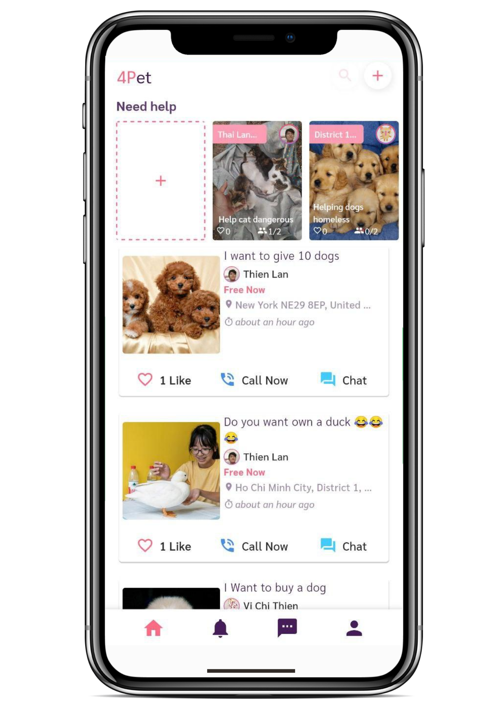
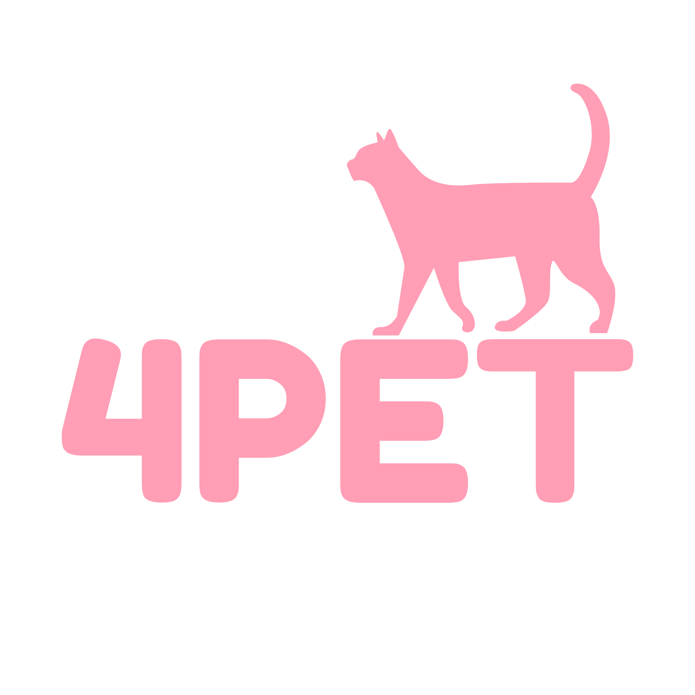

The mobile application for 4PET - The social network for your pet.

*4PET is a social network for pet lovers. We focus on improving our users' daily experiences, like sharing moments, stories, photos, videos, etc with pets. We develop a pet rescue feature in situations of danger and help them find a new family. In the near future, we will launch a new coin based on Blockchain technology. 4PET will be a pet-specific universe, anything about pets.*

<h4>
    <a href="#features">✨ Features</a> |
    <a href="#screens">📱 Screens</a> |
    <a href="#team">🤝Team</a> |
    <a href="#license">❤️ License</a>
  </h4>

<h2 id="features">✨ Features</h2>

### 🛒 Pet market (in processing)

Safe, reliable, and independent pet trading place.

### 📷 Rich story (in processing)

Upload photos or videos of happy moments with your pet.

### 🚑 Pet rescue (in processing)

Rescue pet in case of danger and support finding a new home for it

### 💌 Tinder for pets (coming soon)

Tinder for pets helps the single pet lovers to go on a date, find pets for adoption, and much more.

### 🚀 Third-party (coming soon)

Connecting services such as medical, insurance, beauty, food, pet rescue centers, etc.

### 💰 Coins (coming soon)

Building a new currency based on the Blockchain.

<h2 id="screens">📱 Screens</h2>

| Pet market 	|  Pet Rescue 	| Notification 	|
|:----------:	|:-----------:	|:------------:	|
|            	|          	|              	|
|  **Chat**  	| **Profile** 	|       **More screens**       	|
|           	|             	|        &#32;      	|

<h2 id="team">🤝Team</h2>

<table>
    <tr>
        <td align="center"><a href="https://github.com/103cuong"> <b>Cuong Tran</b></a> <a
                href="https://github.com/4pet-social/4pet/commits?author=103cuong" title="Code">💻</a> <a
                href="#design-103cuong" title="Design">🎨</a> <a
                href="https://github.com/4pet-social/4pet/commits?author=103cuong" title="Documentation">📖</a> <a
                href="#review-103cuong" title="Reviewed Pull Requests">👀</a> <a href="#maintenance-103cuong"
                title="Maintenance">🚧</a> <a href="https://github.com/4pet-social/4pet/commits?author=103cuong"
                title="Tests">⚠️</a></td>
        <td align="center"><a href="https://github.com/tvc12"> <b>Thien Chi Vi</b></a> <a
                href="https://github.com/4pet-social/4pet/commits?author=tvc12" title="Code">💻</a> <a
                href="https://github.com/4pet-social/4pet/commits?author=tvc12" title="Documentation">📖</a> <a
                href="#tool-tvc12" title="Tools">🔧</a> <a href="#maintenance-tvc12" title="Maintenance">🚧</a> <a
                href="#question-tvc12" title="Answering Questions">💬</a> <a
                href="https://github.com/4pet-social/4pet/commits?author=tvc12" title="Tests">⚠️</a></td>
        <td align="center"><a href="https://github.com/HaoCooky97"> <b>Hao Cooky</b></a> <a
                href="https://github.com/4pet-social/4pet/commits?author=HaoCooky97" title="Code">💻</a> <a
                href="https://github.com/4pet-social/4pet/commits?author=HaoCooky97" title="Documentation">📖</a> <a
                href="#tool-HaoCooky97" title="Tools">🔧</a> <a href="#maintenance-HaoCooky97" title="Maintenance">🚧</a> <a
                href="#question-HaoCooky97" title="Answering Questions">💬</a> <a
                href="https://github.com/4pet-social/4pet/commits?author=HaoCooky97" title="Tests">⚠️</a></td>
    </tr>
</table>

<h2 id="license">❤️ License</h2>

